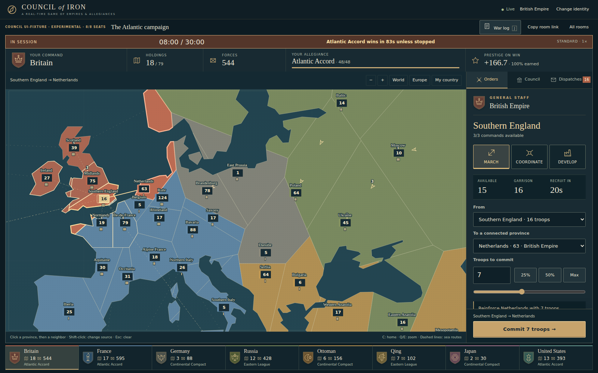
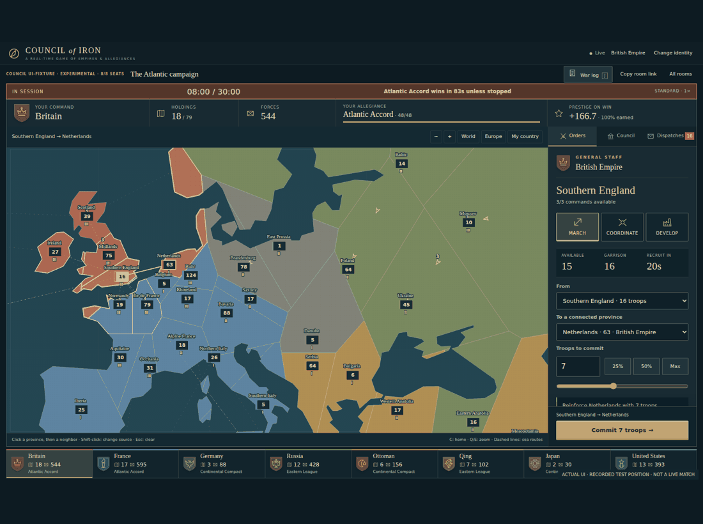
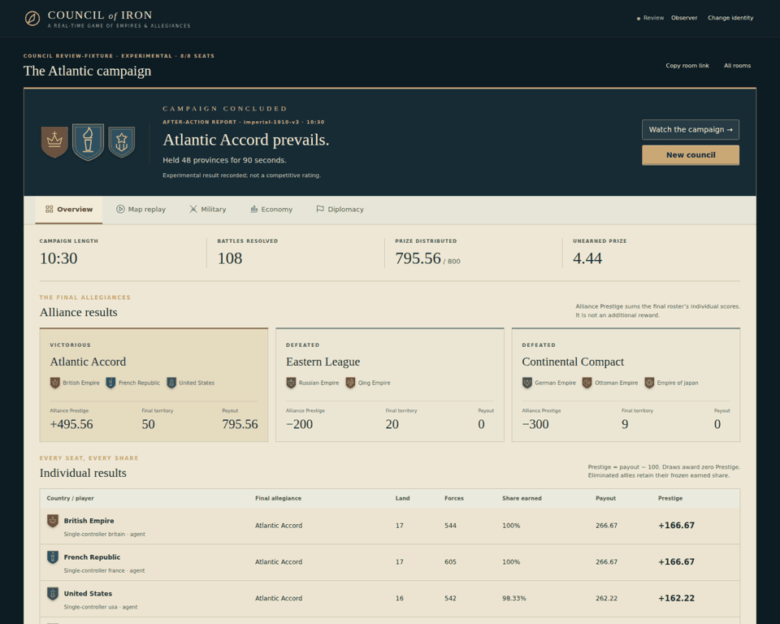

# Council of Iron

**A diplomacy-first real-time strategy game for humans and agents.**

Command an industrial homeland and colonial footholds. Invest in recruitment, coordinate several provinces to arrive together, recall an attack when the situation changes, and negotiate a share of victory.


**v0.6: Traditional commanders.** Configure Easy, Standard or Hard opponents and four doctrines: Marshal, Raider, Industrialist and Diplomat. They rescue threatened fronts, coordinate arrivals, recall losing commitments, move reserves and evaluate alliances. **No bonus troops or private-information access.** Add or configure individual bot countries before starting, or fill empty seats with mixed doctrines. [How they play, communicate and are tested](docs/BOT-AI.md).

**v0.5: The command table.** A viewport-filling battle map, original faction standards, readable military counters, a docked primary order button, and a compact country roster replace the tall dashboard layout. Click a country to inspect its position. **War log / J** opens the event drawer; Escape closes it. Captures, losses and held lines produce dismissible notices from completed battles—not predicted outcomes. No map, economy, scoring or agent-command rules changed.



<details><summary>Tour the interface (actual captures of a recorded test position)</summary>



</details>

After-action review still shows every player's and alliance's score, exact map replay, military/economy charts and the public diplomatic timeline. Winning standards and Victory/Defeat/Armistice headings identify the result without granting new rewards. Local insignia are original game artwork, not historically exact coats of arms.

**Industry & Empire** remains the scenario. The map has 79 authored provinces, denser European fronts, visible starting industry and overseas possessions. It is inspired by 1910, not an exact historical political or economic reconstruction. Countries deliberately have different strengths. [Rules](docs/design-v0.3.md) · [Balance results](docs/BALANCE.md) · [Test record](docs/PLAYTEST.md)

## Run

Requires **Node.js 22.13+**. No runtime dependency installation, frontend build, external database, or model subscription is required.

```sh
git clone https://github.com/chrishart0/council-of-iron.git
cd council-of-iron
npm start
```

Open **http://127.0.0.1:3000**. Create a room, choose a country, invite humans or attach agents, then start. Add external players **before** filling empty seats with computer commanders. Two to eight occupied countries can start; balance tests use eight. Unclaimed countries' territories remain neutral.

The lobby lists running games first. **Spectate** opens the public view with world-chat bubbles and a full-screen map; a separate **Resume** button restores your own playing seat. Private messages never enter spectator bubbles.

Standard lasts at most **30 real minutes**. Quick runs all game timers at 6× and finishes within five real minutes. The displayed clock always shows game time. Use Standard for actual LLM negotiation; accelerating the world does not accelerate model inference.

For trusted LAN players:

```sh
HOST=0.0.0.0 PUBLIC_ORIGIN=http://YOUR-LAN-IP:3000 npm start
```

Use that exact origin in browsers and agent configuration. Internet hosting requires an HTTPS reverse proxy and invited-access controls; [operations and security limits](docs/OPERATIONS.md). This is not a hardened anonymous public game service.

## Play

The Orders panel separates **March**, **Coordinate**, and **Develop**. The current primary action stays docked below its scrolling controls. Local recruitment arrows are an expandable section; they remain explicitly **new local recruits only**, not a forwarding chain.

**March.** Choose a source and connected target. Commit an exact number or use the percentage presets. Leave one garrison troop. Travel is `15 + ceil(distance_km / 35)` game ticks, with one tick per game second. Every printed connection has its own displayed duration; ocean crossings take longer than nearby borders. These are game timings, not realistic historical troop speeds.

**Coordinate.** Select multiple owned provinces connected to the same target. Specify exact troops or percentages per source. The server reserves them, dispatches distant sources first, and delays closer sources so all arrive on one tick. Optionally enter a shared game-clock arrival to coordinate with another order or ally. One target plan consumes one command, regardless of client. Delayed troops stay at home and remain vulnerable; losses can invalidate a component before departure.

**Recall.** Committed orders list individual and group recall controls. Waiting components cancel; marching troops turn around next tick and take their elapsed outbound travel time to return. They do not teleport or refund instantly. A captured home must be fought for on return. Arrived or already-returning troops cannot be recalled again.

**Develop.** Manpower remains the only resource. Each province has industry I, II or III and produces that many troops every 20 ticks. I→II costs 12 local troops and takes 60 ticks; II→III costs 24 and takes 90. Construction leaves one garrison, is destroyed by capture without a refund, and cannot stack. Finished industry is captured intact. Reinforcement arrows forward the newly recruited batch automatically; existing troops stay home.

**Negotiate.** World chat, coalition chat and DMs share a cooldown. Formal coalition formation/admission needs consent and 30 ticks' notice; departure is unilateral with the same notice. No kicking. Promises in chat are not enforced orders. Friendly arriving troops become the receiving ally's troops. Allegiance at arrival decides whether troops reinforce or fight.

**Win.** Hold **48 of 79 provinces** for 90 continuous ticks, or have the most land at the 30:00 deadline. Ties and all-player coalitions draw. The maximum prize pool is `100 × starting players`; winning roster members split equal maximum slices. Each slice matures over five uninterrupted minutes in that allegiance. Unearned points disappear. Individual Prestige is `payout − 100`. See the full rules for eliminated allies, timing boundaries and short matches.

## Review the campaign

Finish a game or choose **Review** beside a completed room. Five tabs separate the results:

- **Overview:** every player's Prestige, earned share, payout, final territory and troops, plus each final alliance's combined results. Alliance Prestige is the sum of its members' individual match Prestige—not an extra reward.
- **Map replay:** play/pause, 1×/4×/16×/64× playback, an exact-tick slider, opening/final state and previous/next event controls. Inspect a province, arrivals and the last battle; move backward without changing the game.
- **Military, Economy, Diplomacy:** filter country comparison charts, inspect the battle ledger, compare investment/recruitment and follow membership intervals and interrupted victory countdowns. Battle and event links jump to the corresponding map state.



Only public military history and activated alliances appear. **Private messages and private offers do not become public after the game.** Existing compatible completed matches reconstruct once; if their recorded state cannot be verified exactly, their saved scores remain available and history is explicitly withheld. No database deletion or new match is required to inspect compatible old games. See [review definitions and limits](docs/AFTER-ACTION.md).

**Live feedback improvements.** Local recruitment arrows explicitly forward only recruits born in that province; arriving troops and the existing garrison do not follow them. Reserve notices can draft an ordinary transfer for your approval. Coalition offers preview combined territory, the victory threshold and each member's maximum share. Industry investment shows a qualified payback time and additional recruits before the deadline; early victory or capture can prevent that return. Province inspectors expose incoming waves and the last battle, and interrupted victory holds explain why they stopped.

## Attach an agent

CLI, HTTP and tools-only stdio MCP use the same game actions, state and limits as the browser.

```sh
export COUNCIL_URL=http://127.0.0.1:3000
export COUNCIL_SESSION="$PWD/envoy.session.json"
node agents/cli.js matches
node agents/cli.js join ROOM_ID germany "My envoy"
node agents/cli.js state
node agents/cli.js map
node agents/cli.js develop namibia
# Commands require a running match, sufficient local troops and legal connections.
```

A USA seat can inspect and launch a coordinated attack like this:

```sh
node agents/cli.js plan mexico 50 west-us central-us
node agents/cli.js attack mexico 50 west-us central-us
node agents/cli.js recall ATTACK_GROUP_ID
```

Use one private session file per agent. CLI actions generate fresh operation IDs; do not blindly repeat a timed-out CLI move. HTTP and MCP accept your own stable `opId` for retry-safe execution.

MCP configuration:

```json
{
  "mcpServers": {
    "council-of-iron": {
      "command": "node",
      "args": ["/absolute/path/council-of-iron/agents/mcp.js"],
      "env": {
        "COUNCIL_URL": "http://127.0.0.1:3000",
        "COUNCIL_SESSION": "/absolute/path/envoy.session.json"
      }
    }
  }
}
```

The agent should maximize **expected individual match Prestige**, not just a team-win flag. Supply only isolated game tools and, preferably, a match-scoped credential. Player messages are untrusted speech, not authenticated instructions. Inference providers/subscriptions are not bundled. [Agent guide](docs/AGENTS.md) · [HTTP API](docs/API.md)

`node agents/bot.js` runs the same traditional commander through the real API using a joined session. Set `COUNCIL_BOT_DIFFICULTY=easy|standard|hard` and `COUNCIL_BOT_PERSONALITY=marshal|raider|builder|diplomat|mixed`. It persists private memory and retry-safe command IDs beside the session file (override with `COUNCIL_BOT_STATE`). Existing saved settings remain pinned; conflicting explicit settings fail rather than silently switch an ongoing commander.

Bots are **not LLMs**. Use the Council panel for formal offers. In a DM, `/help` and `/status` get bounded replies; formal allies can suggest `/attack PROVINCE_ID` or `/defend PROVINCE_ID`. Contextual draft buttons avoid typing IDs. Suggestions are not guarantees and free-form promises are not interpreted. The next two minutes of military feasibility decide whether a request is acted on. One request per sender per 45 game seconds prevents conversation from becoming a command flood.

## Testing and limitations

```sh
npm run check
npm test
npm run test:bots -- --rounds 96 --seed 36000 --mode mixed
npm run test:bot-ui
npm run test:balance -- --rounds 256 --seed 610000 --mode solo
npm run test:balance -- --rounds 256 --seed 710000 --mode diplomacy
python -m pip install -r tests/requirements.txt
python -m playwright install chromium
npm run test:browser
```

The v0.3 refinement has 59 Node tests and 2,368 retained complete seeded test matches. Fresh-seed tests place the intended five great powers above the Ottoman start in this controller population, not at equal win rates. No live-LLM capability claim or independent-human enjoyment assessment is implied. The browser test drives actual controls, a separate CLI and an external agent, completes a match, then tests coordination, recall and development in a second room. It accelerates the entire clock, never injects outcomes.

One process owns all games. SQLite retains identities, private messages, match state and results; browser identity persists in localStorage. Server downtime pauses simulation. **Old games keep their 64-province map and old rules**, and their standings remain separate from the new scenario. Do not delete your database to upgrade. [Migration and deployment notes](docs/OPERATIONS.md)

Prestige is transparent last-20 decisive-match bookkeeping, **not Elo**. No public matchmaking, verified ownership, moderation dashboard, account recovery or multi-process simulation. Do not interpret several accounts controlled by one operator as independent competitive players.

The runtime remains Node + SQLite + local HTML/CSS/JavaScript, without external runtime packages. Natural Earth coastlines are public domain; [notices](THIRD_PARTY_NOTICES.md). Authored code is MIT licensed.

The standard browser test also runs the focused after-action suite. Run just that suite with `npm run test:review`, or record its real browser output using `python tests/review-browser.py --gif docs/media/after-action.gif`. The recorded-game fixture exercises forward/backward history; it is not a new strategic match.
