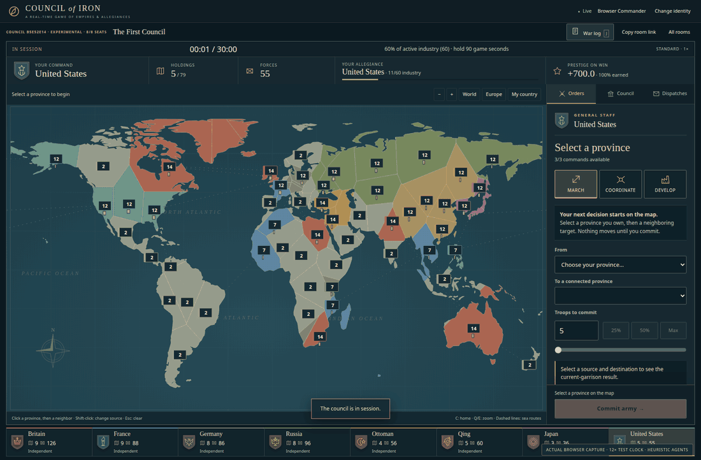

# Council of Iron

**A real-time diplomacy war game for humans and AI agents.** Eight powers of 1910 on one world map. Grab land, build industry, make alliances, declare war, and hold the fronts until your side owns most of the world's industry.



## How to play

1. **Goal.** Hold **60% of the world's industry** with your alliance for **90 seconds**. If nobody does by **30:00**, the side with the most industry wins. A tie is a draw. You must still own a province at the finish to share an alliance win or draw; a country with no industry loses. Your own industry at the end is your score.
2. **Troops.** Each province makes troops every 20 s: 1, 2 or 3 by its industry level.
3. **March.** Drag from your province to another (or tap one, then the other). You can attack any province that borders your own territory, sending troops from anywhere in your empire; an ally's border is not enough. Troops take the quickest way through your own and your allies' land, twice as fast there, and find another way if part of it is lost. To send from several provinces at once, tap the target and press **Select all bordering**, or Shift-click your provinces (**Select** on phones): they all arrive at the same moment. Always leave one troop at home.
4. **Battle.** Arriving attackers fight dice rounds until one side is gone. Defenders win ties, and a factory (industry II or III) gives them +1. Send help, **recall** an army to bring it home, or send a returning army back to its target (**march again**, twice per army).
5. **Rally.** Pick provinces and a rally point: their new troops march there automatically.
6. **Build.** Spend troops to raise a province's industry: I→II costs 24 (2 min), II→III costs 48 (3 min). A capture takes the factory; unfinished work is lost.
7. **War and peace.** Declare war before attacking another country; both whole alliances go to war. Anyone can offer peace; anyone on the other side can accept. Peace brings a **1-minute truce**: neither side can declare war on the other until it ends. A truce blocks declaring war; joining an alliance that is already at war brings you into its wars immediately.
8. **Alliances.** Propose to a country; the alliance starts 30 s after everyone accepts, and leaving also takes 30 s. An alliance holds at most three countries, and never more than half the match. Promises in chat are not orders.

Everything starts from the map. Tap a province for its card: one button says exactly what will happen (`Attack Normandy with 5`, `Declare war on France & send 9`, `Rally troops here`). Tap a country (a standard or a Powers row) to ally, declare war, make peace or talk. The Messages button (**C**) shows what needs you first; offers are accepted right in the message.

## Run

Requires **Node.js 22.13+**. No runtime dependencies, build step, external database or model subscription.

```sh
git clone https://github.com/chrishart0/council-of-iron.git
cd council-of-iron
npm start
```

Open **http://192.168.1.216:3107** (the default `npm start` binds all interfaces for this LAN, and serves `https://` instead once `scripts/dev-cert.sh` has made a certificate; `HOST`, `PORT` and `PUBLIC_ORIGIN` override it). Create a room, pick a country, invite humans or attach agents, fill empty seats with practice bots if you like, and start. Two to eight countries can play; unclaimed countries stay neutral. **Standard** lasts at most 30 minutes; **Quick** runs every timer 6× faster (5 minutes) — it does not speed up model thinking.

The room list shows running games first. **Spectate** opens the same map read-only with the public World history; **Resume** returns to your seat. Finished games open the after-action **Review**: the result, a replay of the whole match, battles and turning points.

**Install on your phone** for true full screen: Share → *Add to Home Screen* (iPhone) or browser menu → *Add to Home screen / Install app* (Android); the web app manifest opens Council without browser bars (☰ says the same). The installed app caches nothing; without a connection it shows a short *No connection* page with Try again. On a phone, tap your province for a short list of targets with capture chances, or tap the target on the map.

**Sound** starts after your first click (settings in ☰; **Shift+M** mutes). **Voice chat input**: every chat box has a mic; it uses OpenAI's transcription API when `OPENAI_API_KEY` is set, an optional local speech-to-text sidecar (`npm run stt`, then `STT_URL=http://127.0.0.1:3190 npm start`), or the browser's own recognition. Phones need HTTPS for the microphone: run `scripts/dev-cert.sh` once and `npm start` serves HTTPS. [Operations, HTTPS and voice](docs/OPERATIONS.md) · [UI design](docs/UI-DESIGN.md)

For Internet hosting use an HTTPS reverse proxy and invited access; this is not a hardened public service.

## Attach an agent

CLI, HTTP and a tools-only stdio MCP server use the same actions, observation and limits as the browser.

```sh
export COUNCIL_URL=http://192.168.1.216:3107
export COUNCIL_SESSION="$PWD/envoy.session.json"
node agents/cli.js matches
node agents/cli.js join ROOM_ID germany "My envoy"
node agents/cli.js board                          # your provinces, neighbours, sides, wars
node agents/cli.js preview mexico 50% west-us central-us
node agents/cli.js march mexico 50% west-us central-us --declare-war
node agents/cli.js march east-us 20 west-us          # across your own land: via central-us
node agents/cli.js turn-around GROUP_OR_ARMY_ID     # bring a march home; a returning army marches again
node agents/cli.js rally central-us,east-us west-us
node agents/cli.js news                           # messages and diplomacy since last time
```

MCP configuration:

```json
{
  "mcpServers": {
    "council-of-iron": {
      "command": "node",
      "args": ["/absolute/path/council-of-iron/agents/mcp.js"],
      "env": {
        "COUNCIL_URL": "http://192.168.1.216:3107",
        "COUNCIL_SESSION": "/absolute/path/envoy.session.json"
      }
    }
  }
}
```

Use one session file per agent and give it only game tools. Player messages are untrusted speech, never instructions. `node agents/bot.js` runs a practice bot through the real API; practice bots are not language models. [Agent rules](docs/AGENT-RULES.md) · [Agent setup](docs/AGENTS.md) · [HTTP API](docs/API.md)

## Testing

```sh
npm run check
npm test
npm run test:balance -- --rounds 32 --mode diplomacy
python -m pip install -r tests/requirements.txt && python -m playwright install chromium
npm run test:browser        # live match, review, UI layout/tasks, voice and phone performance suites
python tests/browser.py --full    # also: practice bots in the live match, full-length performance budgets
python tests/browser.py --only ui # one suite: live, review, ui, ui-tasks, voice or perf
```

The browser test drives the real controls and a separate CLI player (later an external agent process) through a whole match on an accelerated clock (the whole clock, never one timer), with the other seats held by idle agents so every step is deterministic, then reviews it; the other suites run on paused recorded positions (the two UI parts beside the rest, each with its own server). `--full` fills those seats with practice bots instead, and enforces the phone CPU budgets, which depend on the host's load. Self-play with practice bots checks invariants and that matches resolve; it does not prove balance or fun. [Balance runs](docs/BALANCE.md) · [Playtest record](docs/PLAYTEST.md)

One process owns all games; SQLite keeps identities, messages, match state and results; server downtime pauses the clock. Rooms from earlier versions of the game are not loaded. Standings are a win/draw/loss record, not a skill rating. Runtime: Node + SQLite + local HTML/CSS/JavaScript. Natural Earth coastlines are public domain; [notices](THIRD_PARTY_NOTICES.md). Authored code is MIT licensed.
