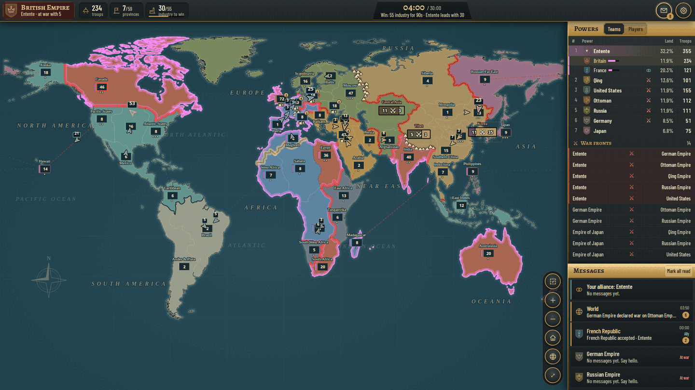
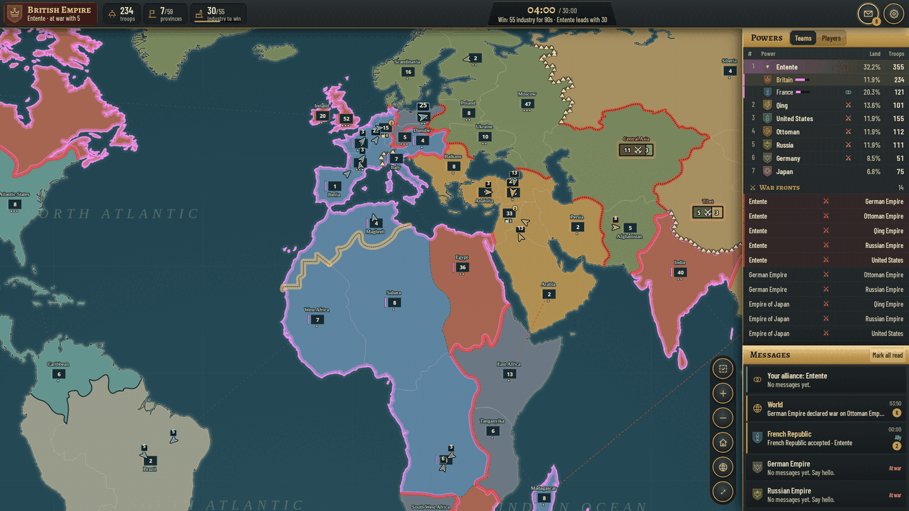
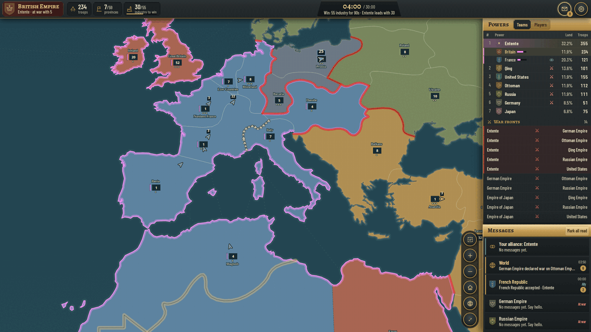
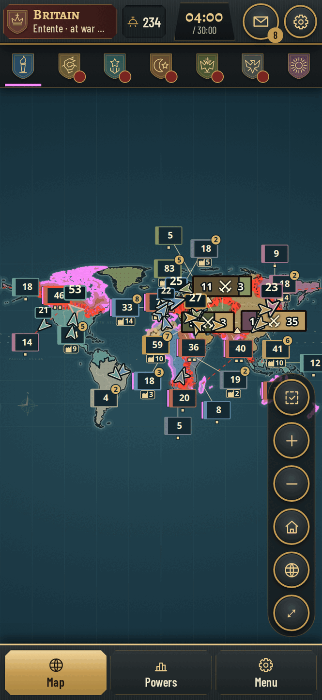
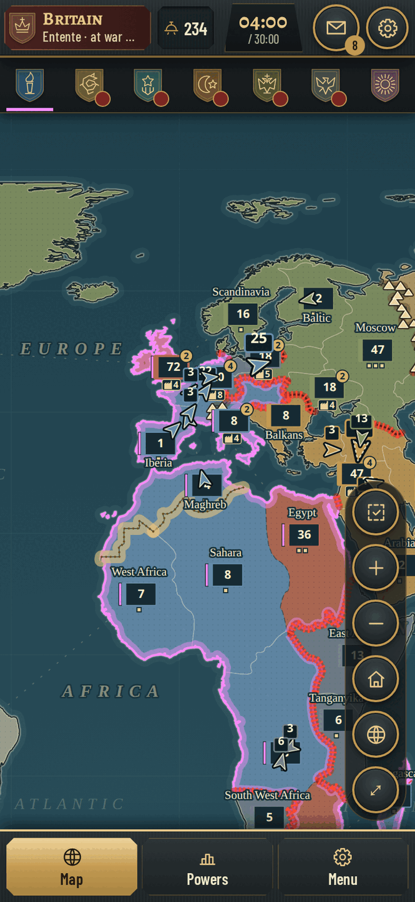
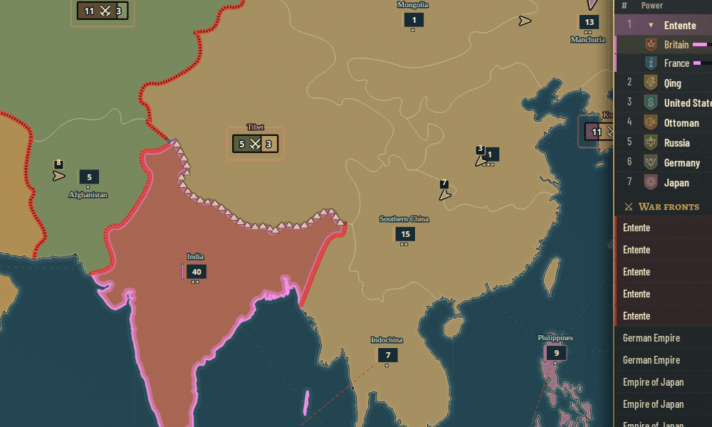
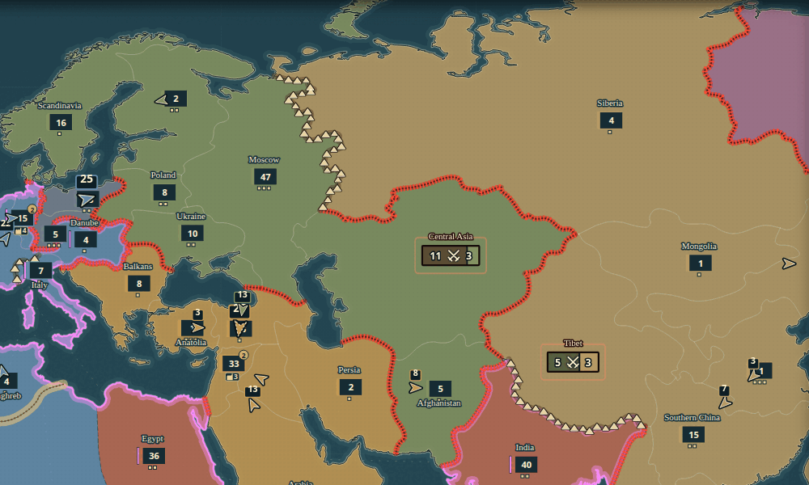
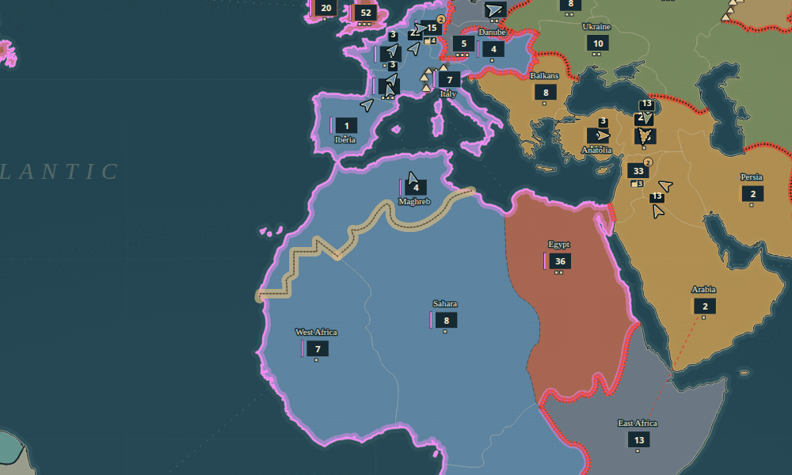
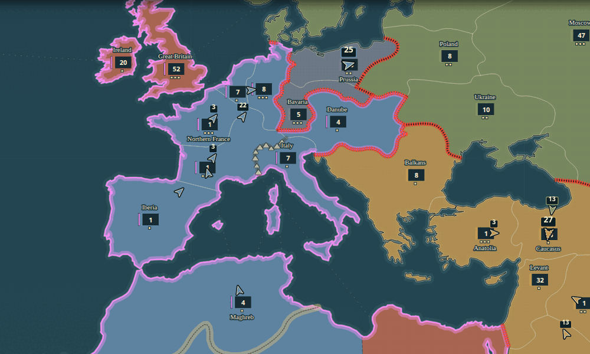

# Map imperial-1910-v6: a simpler board, read like Risk

The user asked to "simplify the map and make the borders look better. Think about Risk, how balanced the map is." This page records the analysis of v5, the v6 design and the evidence. Automated self-play numbers below come from the heuristic practice bots (`tests/simulation.js`). **They are not a claim about human balance or fun.**

Reproduce everything:

```
node scripts/build-imperial-v6.js            # writes public/imperial-map.json (--check verifies it)
node scripts/map-stats.js [map.json]         # the static table below
node scripts/tournament.js --rounds 256 --seed 950000 --mode diplomacy [--map old.json]
node scripts/tournament.js --rounds 256 --seed 960000 --mode solo      [--map old.json]
```

The v5 map for comparison is `git show 683661d:public/imperial-map.json`.

## Rules the map is designed for

- Movement ×1.2. Links whose both ends are yours or an ally's are twice as fast again (sea lanes included).
- Recruitment is 1/2/3 troops per 20 s by industry level. Development costs 24 troops and 2 min for I→II, 48 troops and 3 min for II→III.
- A province at industry II–III adds +1 to the defender's best die.
- Win condition: hold 60% of the owned industry for 90 s, or have the most industry at 30:00.
- **Attacks** (merged from ui-v0.9-gameui): you may attack any province that borders your territory, by land or by a declared sea link. Troops can come from anywhere in your empire, travelling through your own and allied land.
  - So a power's **frontier** is the set of provinces bordering its land. Long internal redeployments stay fast.
  - Chokepoints and sea links decide where fronts form, because every attack needs a border to launch from.

## Part 1 — v5 through a Risk lens

v5 (80 provinces) unions real Natural Earth states and provinces. The borders are accurate, but they are drawn for administration, not for play.

| | v5 |
|---|---|
| Provinces · neutral | 80 · 28 |
| Land links · sea links · mean neighbours | 130 · 48 · 4.45 |
| Rings (separate polygons) | 452 |
| Smallest province landmass (map units²) | Hawaii 66, Belgium 70, Netherlands 75, Southern England 85, Saxony 121, Aquitaine 130 |
| Regions | none drawn |

**Readability**
- At world zoom one map unit is about 1.2 px on a 1536 px map. Belgium, the Netherlands and Southern England are therefore ~9 px squares, and the British Isles hold four provinces.
- Western Europe has 20 provinces inside 60×60 units. Every one of them is hidden behind merged counters until you zoom in.
- The admin borders are jagged, zig-zagging state lines. The dashed hairline style of v5 made them look busier still.

**Adjacency artefacts from the admin geometry.** The v4 → v5 redraw changed 78 adjacencies. Many were accidental:
- The Netherlands lost its borders with Brandenburg and Scandinavia.
- A one-segment contact between the Danube lands and the Rhineland had no link.
- The Channel, the Irish Sea and other short straits needed hand-authored sea links to stay playable.

**Balance of the starts** (static, `scripts/map-stats.js`; order: Britain / France / Germany / Russia / Ottoman / Qing / Japan / USA):

| v5 | |
|---|---|
| Provinces | 10 / 9 / 8 / 8 / 4 / 5 / 3 / 5 |
| Industry | **23** / 18 / 16 / 15 / 6 / **5** / 6 / 11 (4.6× spread) |
| Troops | **133** / 88 / 86 / 96 / 56 / 60 / **36** / 55 |
| Attackable provinces (frontier) | 25 / 18 / 11 / 15 / 7 / 8 / 6 / 10 |
| … of which neutral | 13 / 10 / 7 / 5 / 4 / 1 / 1 / 4 |
| Sea links touching the power | 19 / 13 / 3 / 2 / 1 / 2 / 6 / 10 |
| Capital → nearest rival (ticks) | 57 / 21 / 24 / 59 / 59 / 34 / 73 / 67 |
| Neutral provinces within 120 ticks | 20 / 15 / 14 / 11 / 12 / 4 / **0** / 4 |
| Expansion race (neutrals reached first) | 4 / 6.5 / 6 / 1 / 3.5 / **0** / **0** / 7 |

Read like Risk, the v5 opening has four problems:
- **Industry decides the win**, and the three Western powers start with 57 of the 100 world industry.
  - Britain, France and Germany sit in a 60-unit square with 13 neutral provinces around them.
  - Qing (5 industry, 12 troops per province) and Japan (0 neutrals within reach) start behind.
- **Asia has no race.** Qing and Japan reach no neutral land first. Their only growth is war.
- **Britain is everywhere.** It has 19 sea links, 25 attackable provinces and 133 troops spread over 10 provinces.
- **The Pacific** is only reachable through long lanes. Hawaii (added in v4) is the one stepping stone. The Americas are a USA backyard: 7 neutral provinces that no other power reaches first.

**Baseline self-play** (v5, same engine, seeds 950000+ and 960000+). "Wins" is the number of rounds in which the country was on the winning side:

| | v5 diplomacy (256) | v5 solo (256) |
|---|---:|---:|
| Mean match (ticks) · decisive by 60% hold · deadline wins · draws | 1246 · 207 · 49 · 0 | 1734 · 65 · 188 · 3 |
| Battles per match · median battle length (ticks) | 318 · 10 | 449 · 10 |
| Idle share (surplus unmoved > 120 ticks) · interior only | 19.8% · 6.7% | 23.3% · 7.0% |
| Wins Germany / Britain / France / USA | 143 / 137 / 133 / 132 | 108 / 28 / 63 / 48 |
| Wins Russia / Japan / Qing / Ottoman | 72 / 61 / 49 / 40 | 3 / 0 / 0 / 3 |
| **Max / min (standard deviation)** | **143 / 40 (41.4)** | **108 / 0 (36.6)** |

The required gate run (`--rounds 32 --mode diplomacy`, seeds 1000+) gave:
- Britain 19, USA 19, France 18, Germany 16, and 7 each for the four Eastern powers.
- 25 of 32 matches decisive.

## Part 2 — v6 design

### Province count: 59

v6 has 59 provinces (40 held at the start, 19 neutral), 87 land borders, 34 sea links and 5 impassable borders (see below).

The count is set by the smallest province worth its own counter at world zoom on a phone. Classic Risk has 42 territories for up to 6 players; 8 powers with colonies need more. 59 is the count where every European province is at least ~140 units², double v5's smallest mainland province, so it is several phone taps wide at the mid zoom. Going lower would merge historical cores (Prussia with Bavaria, Moscow with Ukraine) and would leave too few provinces for an eight-way expansion race.

Merges:

| Region | v6 provinces (v5 members in brackets where merged) |
|---|---|
| North America (6) | Alaska, **Canada** (Eastern + Western Canada), Pacific States, Great Plains, Atlantic States, **Mexico** (+ Central America) |
| South America (3) | Caribbean, **Brazil** (+ Amazonia), **Andes & Plata** (Andes + Patagonia) |
| Europe (13) | Ireland, **Great Britain** (England, Midlands, Scotland), Iberia, **Northern France** (Île-de-France, Normandy), **Southern France** (Aquitaine, Occitania, Alpine France), **Low Countries** (Netherlands, Belgium), **Rhineland** (Ruhr, Rhineland), **Prussia** (Brandenburg, East Prussia), **Bavaria** (+ Saxony), **Italy** (Northern + Southern), Scandinavia, Danube, **Balkans** (Serbia, Bulgaria) |
| Russia (7) | Poland, Baltic, Moscow, Ukraine, **Siberia** (+ Urals), Russian Far East, Central Asia |
| Near East (7) | Anatolia, **Caucasus** (Eastern Anatolia), Levant, Mesopotamia, Arabia, Persia, Afghanistan |
| Africa (10) | Maghreb, Egypt, West Africa, **Sahara** (+ Sahel), **Congo** (+ Angola), East Africa, Tanganyika, South West Africa, South Africa, Madagascar |
| Asia (9) | **India** (Northern + Southern), Tibet, Mongolia, Manchuria, Northern China, Southern China, Korea, **Japan** (Northern + Southern), Indochina |
| Oceania (4) | East Indies, Philippines, **Australasia** (+ New Zealand), Hawaii |

Province ids that survive keep their id, so agents, docs and bots mostly still read the same. Merged provinces take the id of their main member: `england`, `ruhr`, `prussia`, `bavaria`, `italy`, `india`, `siberia`, `sahara`, `congo`, `brazil`, `andes`, `australia`, `mexico`. Four ids are new: `canada`, `japan`, `balkans` (now Serbia + Bulgaria; the old Danube-lands `balkans` is `danube`) and `caucasus`.

Regions are presentation only. No rule reads them and there is no continent bonus (see "Optional" below).

### Borders

- The borders are generated by `scripts/build-imperial-v6.js`, which is deterministic, dependency-free and has a `--check` mode. It starts from the v5 geometry (`scripts/map-source/`).
- **Dissolve.** A v5 segment shared by two members of the same v6 province is interior, and it disappears.
- **Topology.** The remaining segments become arcs between junctions. Each land border is one arc, stored once, so both neighbours draw exactly the same line.
- **Generalise.** Land borders are simplified (Douglas–Peucker, 1.6 units) and smoothed (two Chaikin passes) with their end points fixed. Coastlines keep full detail, so the world stays recognisable.
- **Planarity.** A generalised border may not cross another line or come within 0.12 units of one. The builder retries an offending border closer to the source, down to the original line. Four borders needed it: Andes/Brazil, Maghreb/West Africa, Caucasus/Levant and Central Asia/Moscow.
- **Counters** sit on the pole of inaccessibility of the province's main landmass: the interior point farthest from every edge. They are never on an island or next to a border. The published anchor picks the landmass, so Scandinavia stays in Sweden, not Greenland.

### Adjacency: shared border or declared sea link, nothing else

Land links are exactly the pairs that share a border arc. Every other link is in `SEA_LINKS`, with the strait or lane it represents (`edges[].strait`). `tests/map-geometry.test.js` enforces this with no exception list:
- every land link has a shared border of at least 1 unit;
- every shared border is a land link;
- no sea link joins provinces that touch;
- the published file equals the builder's output.

**Chokepoints**, where fronts form now that every attack needs a border:
- **The Bosporus.** Anatolia touches Europe only through the Balkans.
- **The Caucasus.** It borders Anatolia, Levant, Mesopotamia, Persia, Ukraine and Moscow: the Russo-Ottoman front.
- **Suez.** Egypt joins Africa and the Levant, with sea lanes to Britain, Arabia and India.
- **The Rhine.** The Low Countries are the Channel bridgehead between France, Germany and Britain.
- **Gibraltar and Sicily.** Iberia–Maghreb, Italy–Maghreb and Southern France–Maghreb are the three Mediterranean crossings.
- **Korea**, the only land contact between Japan's empire and the mainland. Tsushima links it to Japan, and it borders Manchuria and the Russian Far East.
- **Central America (Mexico)**, the only land gate between the continents; the Florida Straits link the Atlantic States to the Caribbean.

**Sea links (34):**
- Atlantic:
  - North Atlantic lane (Canada–Ireland)
  - Irish Sea (Great Britain–Ireland)
  - English Channel (Great Britain–Northern France)
  - North Sea (Great Britain–Low Countries, Great Britain–Scandinavia)
  - Florida Straits (Atlantic States–Caribbean)
  - South Atlantic narrows (Brazil–West Africa)
- Mediterranean:
  - Gibraltar (Iberia–Maghreb)
  - Marseille–Algiers (Southern France–Maghreb)
  - Sicily (Italy–Maghreb)
  - Otranto (Italy–Balkans)
- Imperial lanes:
  - Great Britain–Egypt
  - Egypt–India
  - India–Australasia
  - Rhineland–South West Africa and South West Africa–Tanganyika (the German colonial lanes)
  - West Africa–Madagascar and Madagascar–Indochina (the French lanes)
- Indian Ocean:
  - Red Sea (Egypt–Arabia)
  - Bab-el-Mandeb (Arabia–East Africa)
  - Hormuz (Arabia–Persia)
  - Mozambique Channel (Madagascar–Tanganyika, Madagascar–South Africa)
- Pacific:
  - Bering (Alaska–Far East)
  - Sakhalin (Japan–Far East)
  - Yellow Sea (Korea–Northern China)
  - Tsushima (Korea–Japan)
  - Ryukyu chain (Japan–Philippines)
  - South China Sea (Philippines–Southern China)
  - Celebes (Philippines–East Indies)
  - Timor (East Indies–Australasia)
  - Hawaii–Pacific States, Hawaii–Japan, Hawaii–Philippines

v5's direct Pacific States–Japan and Pacific States–Philippines lanes are gone. **Hawaii is now the only mid-Pacific crossing** (the Bering Strait remains in the north), a real stepping stone that the USA and Japan both want. At the end of the 256 final diplomacy matches the USA held it in 160, Qing in 43 and Japan in 38. The transatlantic Atlantic States–Great Britain lane is gone too. The Atlantic crossings are the northern Canada–Ireland lane and the southern Brazil–West Africa narrows, so Britain and the USA meet in Canada rather than across open sea.

### Impassable terrain (user request: "use mountains/deserts … to bottleneck gameplay")

A barrier is a drawn border that is **not** a link: no new rule, the two provinces are simply not neighbours, and the map draws the terrain that explains why. They are declared in `BARRIERS` in the builder and published as `barriers[]` (`a`, `b`, `terrain`, `name`, `around`). The geometry test accepts a shared border only as a land link or a declared barrier. It also checks that every province stays reachable and that every power still borders neutral land.

| Barrier | Border | Chokepoint it creates |
|---|---|---|
| **Himalayas** (mountains) | India–Tibet | India is reached through Afghanistan (the north-west) or Indochina (Burma), or by sea. Qing loses its direct front with British India. |
| **Urals** (mountains) | Moscow–Siberia | European and Asian Russia meet only through Central Asia, so Siberia is a separate front, reinforced the long way round. |
| **Alps** (mountains) | Italy–Southern France | Italy is entered through the Danube lands (the eastern passes) or by sea. France's southern flank is shut; the Rhine and the Low Countries stay the Franco-German front. |
| **Sahara** (desert) | Maghreb–Sahara, Maghreb–West Africa | North Africa is cut off from sub-Saharan Africa. The Maghreb is reached by sea (Gibraltar, Marseille, Sicily). Africa is entered up the Nile (Egypt–Sahara, Egypt–Congo), through East Africa or by sea. |

Tried and dropped:
- **Swiss Alps** (Southern France–Danube) and the **Libyan Desert** (Egypt–Sahara). With all seven barriers, France's Maghreb, Sahara and Alpine flank were sealed together. France's winning-side appearances rose from 130 to 165 of 256 (diplomacy), a safe backyard no one could contest.
- **Andes** (Andes–Brazil), a Pacific coast strip. It changed nothing beyond noise (USA 151 → 143 of 256).
- **Pyrenees**. Iberia would have been reachable only by sea.
- **Gobi**. It would leave Qing a single neutral neighbour.

In the UI:
- Mountains are drawn as a brown ridge band with small upright peaks. The peaks are regenerated per zoom so they keep a constant screen size.
- Deserts are a stippled sand band.
- Terrain sits above the alliance glow and below counters, and is quieter at near zoom. The border line is drawn as terrain, not as a province or country border. War fronts never run along it, but alliance outlines still close over it.
- Hovering or tapping it explains it, for example "The Himalayas: impassable. Mountains between India and Tibet. India is reached through Afghanistan or Indochina, or by sea."
- Dragging a march onto a province across it shows "Himalayas · impassable" with the same explanation.
- The map key lists the barriers by terrain.
- **Agents** read `barriers` in `map` and `board.own[].impassable`. A refused attack or march names the barrier and the way around.

### Starting setups

`[industry, troops]` per province, authored in `COUNTRIES` in the builder:

| Power | Holdings | Industry | Troops |
|---|---|---:|---:|
| Britain | Great Britain 3/16, Ireland 1/8, Canada 2/22, India 2/16, Egypt 2/12, South Africa 1/8, Australasia 1/8 | 12 | 90 |
| France | Northern France 3/16, Southern France 3/14, Maghreb 1/8, West Africa 1/7, Indochina 1/7, Madagascar 1/6 | 10 | 58 |
| Germany | Rhineland 3/16, Prussia 2/15, Bavaria 3/15, Tanganyika 1/7, South West Africa 1/6 | 10 | 59 |
| Russia | Moscow 3/16, Baltic 2/12, Poland 2/14, Ukraine 2/12, Siberia 1/10, Central Asia 1/10, Far East 1/10 | 12 | 84 |
| Ottoman | Anatolia 3/16, Levant 1/10, Mesopotamia 2/10, Arabia 1/6 | 7 | 42 |
| Qing | Manchuria 2/12, Northern China 3/14, Southern China 2/12, Tibet 1/6 | 8 | 44 |
| Japan | Japan 3/24, Korea 3/20 | 6 | 44 |
| USA | Pacific States 2/12, Great Plains 2/12, Atlantic States 3/14, Alaska 1/6, Philippines 1/6 | 9 | 50 |

Total opening industry is 74. The 60% line is therefore 45, and no two powers together reach it.

The static picture after the redesign (order: Britain / France / Germany / Russia / Ottoman / Qing / Japan / USA):

| v6 (with the impassable terrain) | |
|---|---|
| Provinces | 7 / 6 / 5 / 7 / 4 / 4 / 2 / 5 |
| Industry | 12 / 10 / 10 / 12 / 7 / 8 / 6 / 9 (**2.0× spread, was 4.6×**) |
| Troops | 90 / 58 / 59 / 84 / 42 / 44 / 44 / 50 (**2.1×, was 3.7×**) |
| Attackable provinces (frontier) | 18 / 14 / 9 / 14 / 5 / 8 / 5 / 8 |
| … of which neutral | 7 / 7 / 5 / 7 / 4 / 2 / 1 / 4 |
| Rival powers adjacent | 4 / 3 / 3 / 4 / 1 / 4 / 3 / 4 |
| Sea links touching the power | 11 / 9 / 3 / 2 / 3 / 2 / 5 / 7 |
| Capital → nearest rival (ticks) | 27 / 27 / 34 / 66 / 67 / 40 / 75 / 55 |
| Neutral provinces within 120 ticks | 13 / 11 / 9 / 10 / 8 / 4 / 1 / 4 |
| Expansion race (neutrals reached first) | 2 / 2.5 / 4.5 / 1 / 3 / 1 / 0 / 5 |

Why these numbers:
- **Qing** was the weakest power in every v5 run. It gets real industry (8, was 5) on fewer, larger provinces: the two Chinese cores are III and II.
- **Japan** stays small (two provinces, 6 industry). It has the densest garrison (22 per province) and the second-longest distance to a rival (75 ticks, behind Korea and the sea). Japan is the Risk "Australia": easy to hold, hard to grow. Its growth is Hawaii and the Russian Far East, or war.
- **The Ottomans** hold Arabia and see only one rival across a land border (Russia, through the Caucasus). They are a defensive corner with four neutral neighbours.
- **Britain** keeps the largest army and the most sea links, but its industry falls to 12 (from 23). A sprawling empire is strong in troops and weak in cohesion.
  - Canada is one province with 22 troops, a real frontier against the USA rather than a free gift.
  - The v5 Scotland/Midlands/England split is gone.
- **France and Germany** each have 10 industry on 5–6 provinces and meet across the Rhine and the Low Countries, the busiest front in Europe.
- **The USA** keeps the Americas' four neutral provinces (Mexico, Caribbean, Brazil, Andes & Plata). It has a secure backyard like Risk's South America, but only 4 neutral provinces (was 7) and no direct lanes to Japan, Britain or the Philippines.

Considered and rejected (the first is kept as a candidate in `tests/balance-cases.json`, `v6-open-manchuria`; these trials ran before the terrain barriers and the merged border rule):
- **Manchuria starting neutral**, a flashpoint for Japan, Russia and Qing. Over 256 + 256 seeds it only moved winning-side appearances from Qing (87 → 60) to Japan (70 → 88).
- **Canada at 28 troops** only moved wins from the USA to Britain and Germany without narrowing the spread.

Starting armies were not tuned further to the bots.

### Rendering (`public/atlas.js`, `public/map-layers.css`)

- **Coast.** A soft wide shelf and a tighter sea glow sit under the land. A pale casing under a dark coastline gives an engraved double line.
- **Province borders** inside one country are a clean, light, continuous hairline; v5's dashes are gone, since the smoothed lines no longer need hiding.
- **Country borders** are a strong dark line: 1.5 px at world zoom, 1.9 px at mid zoom and 2.6 px zoomed in.
- **Region names** (NORTH AMERICA, EUROPE, AFRICA …) show only at world zoom, between the land and the counters. They are placed in open sea or empty land (`regions[].x/y`).
- **Germany** is re-coloured slate (`#76808c`); its old grey-brown was hard to tell from neutral land.
- **Unchanged:** level of detail, clustering, wraparound, alliance blocs, war fronts, battle tokens, armies on top and every host hook.

## Part 3 — Evidence

### Balance comparison

Heuristic self-play on the final merged engine, which includes the border attack rule, truces, alliances capped at three countries and no victory credit without territory. There are 256 matches per cell with the same seeds (diplomacy 950000–950255, solo 960000–960255). "v6 open" is the same map with the five barriers turned back into land links, to isolate their effect. The solo columns ran before the alliance cap, which does not apply without alliances.

| | v5 diplomacy | v6 open | **v6 diplomacy** | v5 solo | v6 open | **v6 solo** |
|---|---:|---:|---:|---:|---:|---:|
| Mean · median match (ticks) | 1368 · 1440 | 1378 · 1404 | 1397 · 1440 | 1734 · 1800 | 1720 · 1800 | 1755 · 1800 |
| Decisive (60% hold) · deadline wins · draws | 185 · 70 · 1 | 202 · 54 · 0 | 186 · 68 · 2 | 65 · 188 · 3 | 69 · 184 · 3 | 51 · 199 · 6 |
| Battles per match · median battle (ticks) | 347 · 10 | 260 · 10 | 255 · 10 | 449 · 10 | 332 · 10 | 320 · 10 |
| Idle share · interior-only idle | 20.7% · 7.1% | 15.7% · 3.7% | **15.5% · 3.5%** | 23.3% · 7.0% | 18.8% · 5.3% | **18.0% · 4.7%** |
| Mean leg ticks internal / foreign / sea | 21.2 / 42.1 / 48.0 | | 24.4 / 47.4 / 44.4 | 20.9 / 41.9 / 49.9 | | 24.6 / 47.7 / 44.8 |
| Wins Britain / France / Germany / Russia | 120 / 121 / 130 / 44 | 65 / 105 / 89 / 63 | 91 / 111 / 63 / 58 | 28 / 63 / 108 / 3 | 3 / 70 / 35 / 19 | 5 / 83 / 25 / 25 |
| Wins Ottoman / Qing / Japan / USA | 29 / 25 / 33 / 116 | 90 / 58 / 46 / 128 | 75 / 80 / 53 / 133 | 3 / 0 / 0 / 48 | 60 / 8 / 1 / 57 | 57 / 12 / 3 / 40 |
| **Max / min (SD)** | **130 / 25 (44.9)** | 128 / 46 (25.6) | **133 / 53 (25.9)** | **108 / 0 (36.6)** | 70 / 1 (26.0) | **83 / 3 (25.9)** |

The required gate (`npm run test:balance -- --rounds 32 --mode diplomacy`, seeds 1000–1031, 0 invariant failures):

| | v5 | v6 |
|---|---:|---:|
| Max / min (SD) | 15 / 3 (4.2) | 16 / 5 (3.1) |
| Wins | Britain 15, USA 15, Germany 14, France 12, Russia 10, Japan 7, Ottoman 6, Qing 3 | USA 16, Ottoman 12, Qing 11, France 10, Germany 10, Russia 10, Britain 7, Japan 5 |
| Decisive | 24 | 23 |

The 32-round solo run:
- v5: max/min 11 / 0.
- v6: max/min 11 / 0 (France 11; Britain and Japan 0).

At 32 rounds this is noise-level; the 256-round runs are the comparison.

**Effect of the impassable terrain** (v6 open → v6, 256 diplomacy; one standard error is about ±8):
- **Britain / India: 65 → 91.** The Himalayas close Qing's direct road into India, so the Raj is attacked only through Afghanistan, Indochina or by sea.
- **Qing: 58 → 80.** Qing no longer bleeds on the Indian border; its fronts are Russia, Japan and Indochina.
- **Germany: 89 → 63; Ottoman: 90 → 75.** The Alps and the Sahara push the Mediterranean powers into each other: France's southern flank and Maghreb are safe, and the fighting moves to the Rhine and the Balkans.
- **France: 105 → 111; Russia: 63 → 58.** France gains a little, and more in solo (70 → 83): a safer North Africa. The Urals change Russia's routes more than its results.
- **USA: 128 → 133; Japan: 46 → 53.**
- The spread is unchanged within noise (SD 25.6 → 25.9). The barriers reshape who fights whom, not how uneven the table is. The rejected seven-barrier draft pushed France to 165 of 256.

Readings (not claims):
- **The winner spread shrinks** from v5: SD 45 → 26 in diplomacy and 37 → 26 in solo. The weakest power now reaches 53/256 (v5: 25), and four powers were at or below 44 in v5.
  - The Eastern powers gain: Ottoman 29 → 75, Qing 25 → 80, Japan 33 → 53.
  - Germany (130 → 63) and Britain (120 → 91) lose their v5 head start.
- **Matches still resolve** at about the same rate and length, with no stalemates. There are fewer battles (347 → 255), because there are fewer, larger provinces.
- **Idle troops fall by a quarter** (20.7% → 15.5%). With fewer interior provinces, troops are nearer a front.
- **Watch items for human play:**
  - The USA leads in diplomacy (133/256), thanks to its secure Americas.
  - Japan trails (53).
  - Britain is weak in solo mode (5/256): the bots do not defend a scattered empire, and Canada falls to the USA in almost every solo match.
  - Starting armies were not tuned further to the bots.

### Screenshots

These are from a bot-played local preview position at 04:00, not a live match. They show the Britain seat's view, an Entente alliance and several wars.

| | |
|---|---|
|  |  |
|  |  |
|  |  |
|  |  |
|  | |

## Optional, not implemented: region bonuses

Risk's continent bonus would fit the region structure: for example, +1 troop per 20 s for holding a whole region. It would sharpen the expansion decision, but it is a new rule. The one-screen rules and `SIMPLIFY-PLAN.md` would have to justify it. The user should decide.

## Merge notes

- One map: `imperial-1910-v6` replaces v5 everywhere. Rooms saved on v5 are skipped at startup (`loadable`/`startupPlan`); a live v5 room in play makes startup refuse, as the deploy guard intends.
- The branch contains origin/master and origin/ui-v0.9-gameui: the border attack rule, multi-select, truces, the inbox, the playtest harness and the shared lobby.
- Merged tests that named v5 provinces now use v6 ids:
  - `ui-multi-*` attacks the Pacific States from Canada, the Great Plains, Mexico and Hawaii;
  - the truce room uses Ireland;
  - the decision-view partner test uses Germany.
- **Handplay recording.** The recorded match is replayed on v6. `RECORDED_PROVINCE` in `scripts/replay-handplay.js` maps the 26 merged v4/v5 ids.
  - Its golden hashes were re-baselined. It now reaches the deadline, with the Atlantic Accord winning on industry, instead of a tick-553 hold.
  - `tests/fixtures/handplay-map.json` is deleted.
  - The review and UI suites were re-baselined on the replayed position, with the reasons in the commits.
- **Browser second room.** In `tests/browser.py`, the second room's joint attack, development and long march pick provinces the idle USA still holds. On v6, Britain's single 22-troop Canada borders all three US states, and the practice bots attack an idle USA.
- **Province ids used by clients:**
  - `west-canada`/`east-canada` → `canada`
  - `north-japan`/`south-japan` → `japan`
  - `scotland`/`midlands` → `england`
  - and so on (see the table above). Bots and agents read the map, not hard-coded ids.
- **Map changes** go through `scripts/build-imperial-v6.js`, never the JSON. `npm test` fails if the published file differs from the builder's output.
